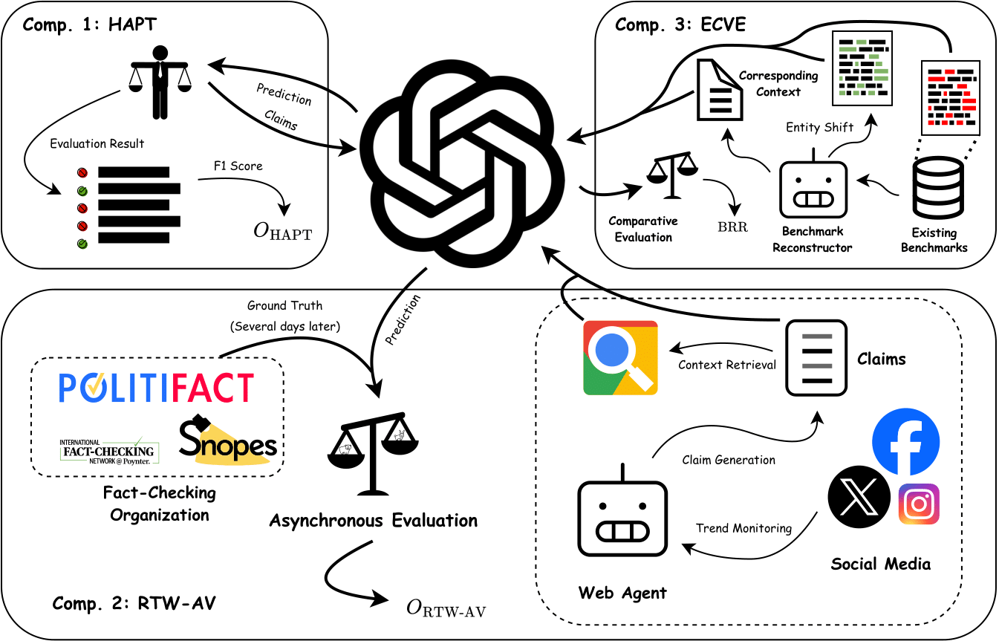

# TripleFact: Defending Data Contamination in the Evaluation of LLM-driven Fake News Detection


TripleFact is a novel evaluation framework designed to address **Benchmark Data Contamination (BDC)** in LLM-based fake news detection. Traditional benchmarks fail in the LLM era because models may have memorized test data during pre-training, leading to inflated performance metrics. TripleFact provides a contamination-resistant methodology that reveals true model capabilities.

**Key Innovation**: TripleFact combines three synergistic components to evaluate LLMs:
- **HAPT**: Human-Adversarial Preference Testing
- **RTW-AV**: Real-Time Web Agent with Asynchronous Validation  
- **ECVE**: Entity-Controlled Virtual Environment

## The Problem: Benchmark Data Contamination (BDC)

### Traditional vs. LLM-Driven Fake News Detection

| Aspect | Traditional Approach | LLM-Driven Approach |
|--------|---------------------|---------------------|
| **Data Scope** | Curated, domain-specific datasets | Massive, open-domain corpora |
| **Training** | Supervised fine-tuning | Pre-training on diverse text |
| **Evaluation** | Closed-world train-test splits | Zero/few-shot prompting |
| **Key Limitation** | Limited generalization | Data contamination risks |

### Why BDC Matters

LLMs trained on trillions of tokens may have seen evaluation benchmarks during pre-training. For example:
- GPT-4's high accuracy on LIAR dataset might reflect memorization, not reasoning
- Models can recite debunked conspiracy theories verbatim
- Performance inflation of up to **23%** due to contamination (our findings)

## The TripleFact Framework

<p align="center"></p>

### Component 1: Human-Adversarial Preference Testing (HAPT)

**Purpose**: Evaluate robustness against human-crafted misinformation that LLMs haven't seen.

**Methodology**:
- Crowd-source real and fake news from human participants
- Minimal guidelines to encourage creative, culturally-nuanced claims
- Zero-shot evaluation of LLMs
- Calculate F1 accuracy score (O_HAPT)

**Example Adversarial Claim**:
> "In 2024, Russia won the Russo-Ukrainian War due to its great superiority and signed the Kiev Liberation Treaty with Ukraine, which ended the war by ceding the Crimean Peninsula to Russia as a price."

### Component 2: Real-Time Web Agent with Asynchronous Validation (RTW-AV)

**Purpose**: Test temporal generalization using claims that emerged after model training.

**Methodology**:
1. Collect real-time tweets via X/Twitter API
2. Generate claims using LLM (e.g., GPT-4o-mini)
3. Retrieve context via Google Search API
4. LLM evaluates claims with retrieved context
5. Asynchronous validation against fact-checking platforms
6. Calculate metrics:
   - **TDA** (Time-Delayed Accuracy): Accuracy after ground truth validation
   - **CUS** (Context Utilization Score): Ratio of claims using ≥3 sources
   - **O_RTW-AV** = CUS × TDA

### Component 3: Entity-Controlled Virtual Environment (ECVE)

**Purpose**: Eliminate entity memorization bias by replacing real entities with fictional ones.

**Methodology**:
- Identify named entities (people, organizations, locations)
- Replace with fictional analogs (e.g., "Pfizer" → "VaxGen")
- Preserve claim semantics while changing entities
- Calculate metrics:
  - **EIA** (Entity-Independent Accuracy): Performance on modified claims
  - **BRR** (Bias Reduction Ratio): EIA - Original Accuracy

**Example Entity Replacement**:
- Original: "WHO releases 2025 update to the International Classification of Diseases"
- Modified: "Global Human Health Institute (GHHI) releases 2025 update to the International Classification of Diseases"

### Unified Metric: TripleFact Score (TFS)

```
TFS = (1 + BRR) × (O_HAPT + O_RTW-AV) / 2
```

This formula:
- Averages human-adversarial and real-time performance
- Applies entity bias correction
- Provides contamination-resistant evaluation

## Experimental Results

### Experiment 1: Evaluating 17 State-of-the-Art LLMs

We evaluated models from GPT, Llama, and DeepSeek families:

| Model | HAPT | RTW-AV | ECVE (BRR) | **TFS** |
|-------|------|---------|------------|---------|
| **o1-preview-2024-09-12** | 0.718 | 0.878 | -0.012 | **0.788** |
| o3-mini-2025-01-31 (high) | 0.688 | 0.823 | -0.011 | 0.747 |
| DeepSeek-R1 | 0.652 | 0.803 | -0.021 | 0.712 |
| gpt-4o-2024-08-06 | 0.575 | 0.733 | 0.030 | 0.674 |
| Llama-3.1-405B | 0.558 | 0.714 | -0.021 | 0.623 |
| Llama-3.3-70B | 0.477 | 0.610 | -0.034 | 0.525 |
| Llama-3-8B | 0.328 | 0.484 | -0.018 | 0.399 |

**Key Findings**:
- o1-preview achieved highest TFS (0.788) with strong performance across all components
- Larger models generally performed better, but size alone doesn't guarantee contamination resistance
- Most models showed negative BRR, indicating reliance on entity memorization

### Experiment 2: Contamination Injection Study

We fine-tuned gpt-4o-mini with varying contamination levels:

| Contamination Type | Level | HAPT Change | RTW-AV Change | TFS Stability |
|-------------------|-------|-------------|---------------|---------------|
| Semantic | 10-100% | +5% | -8% | ±2% |
| Information | 10-100% | +18% | -10% | ±2% |
| Data | 10-100% | +18% | +10% | ±2% |
| **Label** | 10-100% | **+30%** | **+37%** | ±4% |

**Key Finding**: TripleFact Score remained stable (≤4% variation) despite contamination that inflated individual metrics by up to 37%.


## Citation

If you find our work useful in your research, please consider citing:

```bibtex
@inproceedings{xu2025triplefact,
    title = "{T}riple{F}act: Defending Data Contamination in the Evaluation of {LLM}-driven Fake News Detection",
    author = "Xu, Cheng  and
      Yan, Nan",
    booktitle = "Proceedings of the 63rd Annual Meeting of the Association for Computational Linguistics (Volume 1: Long Papers)",
    month = jul,
    year = "2025",
    address = "Vienna, Austria",
    publisher = "Association for Computational Linguistics",
    url = "https://aclanthology.org/2025.acl-long.431/",
    pages = "8808--8823",
    ISBN = "979-8-89176-251-0"
}
```
